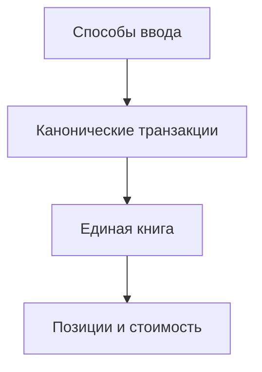

# Режимы ввода данных

> Любой способ ввода в итоге пишет строки в одну книгу сделок.

## Суть

| Режим | Когда | Статус |
|---|---|---|
| **B — с нуля** | Вводишь каждую сделку | готово |
| **A — снапшот** | «Уже есть портфель, историю не помню» | готово |
| **Авто** | CSV / API брокера | позже |

В UI (модалка «Состав»): **+ Позиции** = A, **+ Транзакция** = B. «+ Позиции» скрывается, если в счёте уже есть хоть одна запись (повтор → 409).

## Режим A — снапшот

Вводишь список: актив, количество, средняя цена.  
Система делает `opening`-транзакции на одну дату начала учёта.

В UI у каждой строки можно **опционально** указать накопленный доход (тип, gross, налог; без DRIP). После успешного opening фронт создаёт `POST /income` с `distributed: true` — событие попадает в прибыль позиции / статистику, **кэш не увеличивается** (деньги считаются уже распределёнными). Контракт opening не расширяется.

- Быстро.
- Нет старой истории продаж → старая реализованная прибыль неизвестна.

`POST /accounts/:id/opening` — см. [транзакции](../features/transactions.md). Доход — [income](../features/income.md).

## Режим B — полная книга

Покупки, продажи, вводы/выводы денег.  
Позиции, партии (FIFO) и прибыль считаются из истории.

## Авто (позже)

Отчёты CSV/XML или API брокеров → нормализация → предпросмотр → те же транзакции.  
Идемпотентность: `(source, sourceId)`.

## Сравнение

| | A снапшот | B книга | Авто |
|---|---|---|---|
| Трудоёмкость | низкая | высокая | низкая |
| Точность партий | средняя | высокая | высокая |
| История | нет | полная | полная |

## См. также

- [ADR-003](../decisions/ADR-003-transaction-ledger.md)
- [Состав счёта](../features/composition.md)
- [Правила](rules.md)
