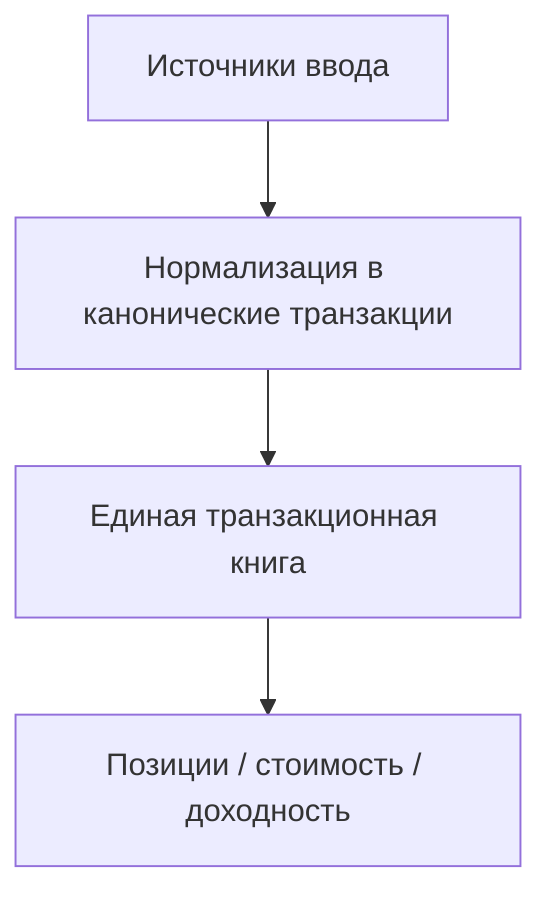
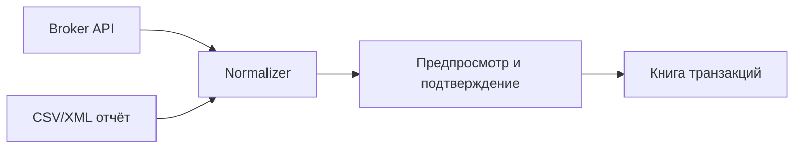

# Режимы ввода данных

Центральный вопрос продукта: как пользователь заносит свои активы. Есть два крупных режима — **ручной** и **автоматический** — и внутри ручного два разных сценария.

## Принцип: всё сводится к единой книге

Независимо от способа ввода, в системе существует **одна** модель — транзакционная книга (ADR-003). Все режимы — это лишь разные способы *породить транзакции*.

## Ручной режим

### Сценарий A: «У меня уже есть портфель» (snapshot-ввод)

Клиент имеет портфель и не может/не хочет воспроизводить всю историю сделок.

- Пользователь вводит **текущие позиции**: актив, количество, среднюю цену покупки (cost basis).
- Система конвертирует это в **`opening`-транзакцию** (покупка на дату «начала ведения» по указанному cost basis).
- Дальше ведётся обычная книга: новые покупки/продажи/доходы добавляются как обычные транзакции.
- **Плюсы:** быстро, не требует истории.
- **Минусы:** нет точной реализованной прибыли по прошлым сделкам; cost basis — средний (AVCO), а не FIFO-разбивка по партиям. Это честно помечается в UI.

### Сценарий B: «Начинаю с нуля / маленький портфель» (полный учёт)

Клиент только начинает или имеет небольшой портфель.

- Пользователь вводит **полную цепочку транзакций**: покупки, продажи, комиссии, налоги, доходы.
- Система строит позиции и cost basis из транзакций (FIFO/AVCO по партиям).
- **Плюсы:** точная реализованная/нереализованная прибыль, полная история, корректные партии.
- **Минусы:** трудоёмко для большого портфеля.

### Как выбрать сценарий

- При первом заведении счёта UI предлагает выбор:
  - «У меня уже есть активы» → сценарий A (snapshot).
  - «Начинаю с нуля» → сценарий B (транзакции).
- Сценарий A — это «быстрый старт»; позже можно доимпортировать историю (авто-режим) и перейти к полной книге.

## Автоматический режим

### Вариант 1: интеграции с API брокеров/бирж

- Прямые интеграции: Tinkoff Invest API, Interactive Brokers, Alpaca, Binance и т.п.
- Бэкенд периодически (или по запросу) тянет операции и приводит их к каноническому формату.
- Требует хранения токенов/ключей пользователя — **только в зашифрованном виде** (см. безопасность).

### Вариант 2: парсинг выгруженных отчётов

- Пользователь загружает файл отчёта брокера (CSV/XML): Tinkoff, IB, и др.
- Бэкенд парсит файл, нормализует строки в транзакции и показывает предпросмотр перед подтверждением.

### Нормализация и идемпотентность

- Все источники приводятся к **каноническому формату транзакции** (общий интерфейс `ImportSource`).
- Каждая строка источника сопоставляется с активом из справочника.
- **Идемпотентность:** уникальный `(source, sourceId)` — повторный импорт не создаёт дубликатов.
- Пользователь видит предпросмотр: новые / совпавшие / пропущенные / ошибочные строки (`ImportItem.status`).

## Сравнение режимов

| Критерий | Ручной A (snapshot) | Ручной B (транзакции) | Авто (API/отчёты) |
|---|---|---|---|
| Трудоёмкость ввода | Низкая | Высокая | Низкая |
| Точность cost basis | Средняя (AVCO) | Высокая (FIFO/партии) | Высокая |
| История сделок | Нет | Полная | Полная |
| Реализованная прибыль | Ограничена | Точная | Точная |
| Требует интеграции | Нет | Нет | Да |

## Рекомендация по MVP

1. **Ручной режим B** (транзакции) — ядро, на нём строится вся книга.
2. **Ручной режим A** (snapshot → opening) — быстрый старт для существующих портфелей.
3. **Авто-импорт отчётов** (CSV/XML) — как следующий шаг, даёт идемпотентную нормализацию.
4. **API брокеров** — позже, по мере востребованности конкретных интеграций.