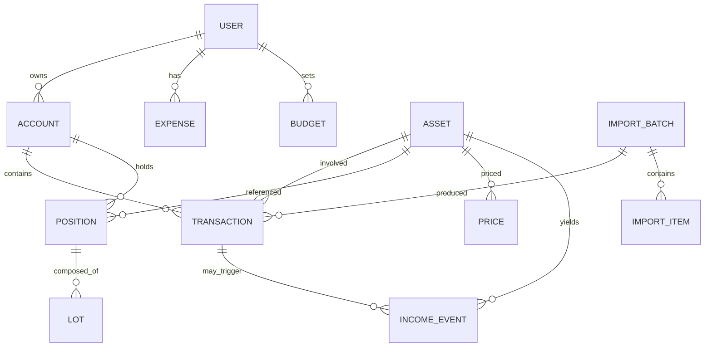

# Доменная модель

## Обзор

Модель построена вокруг **единой транзакционной книги** (ADR-003): позиции и стоимость выводятся из транзакций, а не хранятся отдельно. Доходы (дивиденды/купоны) — это отдельные события (ADR-006).

## Сущности

## Описание сущностей

### User
- `id`, `email` (уникальный), `passwordHash`, `name`, `createdAt`.
- Настройки: базовая валюта, часовой пояс.

### Account (счёт/кошелёк)
- Тип: `broker` (брокерский), `exchange` (крипто-биржа), `wallet` (крипто-кошелёк), `cash` (наличные/банк), `card`.
- `currency` (валюта счёта), `name`, `institution` (брокер/биржа).
- `externalRef` — связь с источником (для авто-импорта).

### Asset (актив/инструмент)
- Тип: `stock`, `bond`, `fund` (ETF/ПИФ), `crypto`, `cash`, `fx`.
- `symbol`, `name`, `isin`/`figi`/`ticker`, `currency`.
- Нормализованный справочник (глобальный, не per-user), чтобы цены и income events были общими.

### Transaction (транзакция — ядро книги)
- Типы: `buy`, `sell`, `dividend`, `coupon`, `fee`, `tax`, `deposit`, `withdrawal`, `transfer`, `opening` (снапшот-ввод), `income` (доход).
- Поля: `accountId`, `assetId` (nullable для денежных), `date`, `quantity`, `price`, `amount`, `currency`, `fee`, `tax`, `note`.
- **Деньги — целые числа** в минимальных единицах (копейки/сатоши) + `currency` (ADR-002).
- `source` + `sourceId` — происхождение (manual / broker-api / import) для идемпотентности.
- `opening`-транзакции помечаются флагом (см. data-entry-modes).

### Position (позиция — производная, кэш)
- Не является источником истины, но кэшируется для скорости: `accountId`, `assetId`, `quantity`, `avgCostBasis`, `currency`.
- Пересчитывается из транзакций (материализованное представление / агрегация).

### Lot (партия — для cost basis)
- `positionId`, `quantity`, `costBasis`, `acquiredAt`.
- Нужен для методов FIFO/AVCO при продажах и расчёта реализованной прибыли.

### Price (цена актива)
- `assetId`, `date`, `price`, `currency`, `source` (какой провайдер).
- Хранит историю для графиков и оценки на дату.

### IncomeEvent (доходное событие — ADR-006)
- Тип: `dividend`, `coupon`, `interest`, `distribution`.
- Ключевые даты (best practice из Investopedia): `announcementDate`, `exDate`, `recordDate`, `paymentDate`.
- Поля: `assetId`, `accountId`, `grossAmount`, `taxWithheld`, `netAmount`, `currency`, `reinvested` (DRIP).
- Может быть связано с транзакцией (когда доход зачислен деньгами) или существовать отдельно.

### Expense (расход) / Budget (бюджет)
- `Expense`: `userId`, `categoryId`, `amount`, `currency`, `date`, `note`.
- `Budget`: `userId`, `categoryId`, `period`, `limit`.
- `Category`: справочник категорий расходов.

### ImportBatch / ImportItem (импорт отчётов)
- `ImportBatch`: `userId`, `sourceType` (broker-api / csv / xml), `status`, `fileRef`.
- `ImportItem`: сырая строка из источника + статус сопоставления (matched / new / skipped / error).

## Связи и правила

- **Позиции выводятся из транзакций** (ADR-003). Никакой параллельной «позиционной» модели.
- **Доходы** — income events (ADR-006), не только денежные операции.
- **Цены** — через PriceProvider (ADR-005), история цен хранится в `Price`.
- **Мультивалютность**: каждая сумма имеет `currency`; пересчёт — только через явный FX-курс (актив типа `fx` / таблица курсов).
- **Идемпотентность импорта**: уникальный `(source, sourceId)` на транзакцию.

## Типы транзакций и их влияние на книгу

| Тип | Количество | Деньги | Влияние |
|---|---|---|---|
| `buy` | + | − | +позиция, −кэш |
| `sell` | − | + | −позиция, +кэш, реализованная прибыль |
| `dividend`/`coupon` | 0 | + | +кэш, income event |
| `fee`/`tax` | 0 | − | −кэш |
| `deposit`/`withdrawal` | 0 | ± | движение кэша |
| `transfer` | 0 | 0 | между счетами |
| `opening` | + | 0 | снапшот-ввод существующего портфеля |