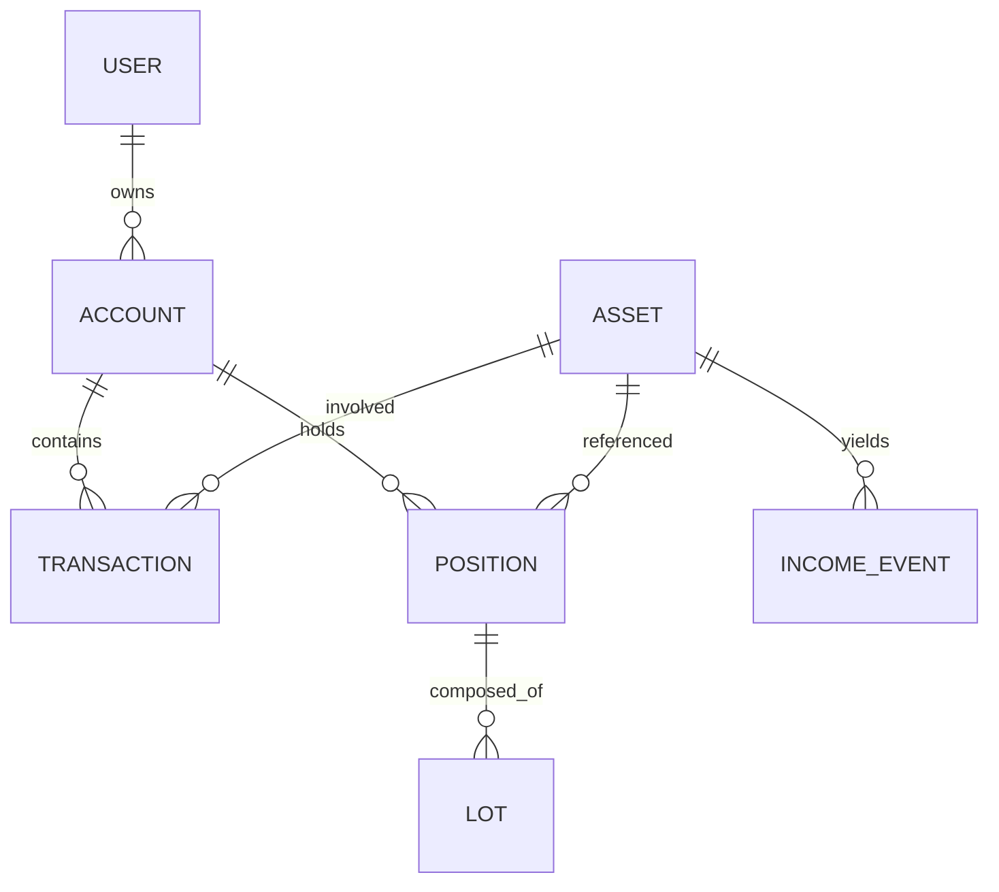

# Доменная модель

> Кто есть кто в данных. Правда — транзакции; позиции и партии — быстрый кэш.

Правила учёта — в [rules.md](rules.md).

## Суть

| Сущность | Простыми словами | Статус |
|---|---|---|
| **User** | Ты: email, пароль, базовая валюта | готово |
| **Account** | Счёт / кошелёк (`broker` / `wallet` / `cash`) | готово |
| **Asset** | Бумага или монета в общем справочнике | готово |
| **ExternalAsset** | Кэш поиска во внешних API | готово |
| **Transaction** | Строка дневника сделок | готово |
| **Position** | «Сколько бумаг сейчас» (кэш из книги) | готово |
| **Lot** | Партия покупки для FIFO | готово |
| **IncomeEvent** | Дивиденд / купон с датами и налогом | готово |
| Price / Expense / Budget / Import* | История цен, расходы, импорт | позже |

## Деньги в БД

Каждая сумма — **два столбца**: `<field>_amount` (`bigint`) + `<field>_currency` (ISO 4217).  
Колонки через `moneyAmountColumn` (`apps/api/src/common/money-column.ts`).

Пример: `12345` + `RUB` = 123.45 ₽.

`quantity` — `numeric(28,8)` (штуки, дробные).

## Таблицы (TypeORM)

| Сущность | Таблица | Ключевое |
|---|---|---|
| User | `users` | email unique, passwordHash, baseCurrency |
| Account | `accounts` | userId CASCADE, type, currency |
| Asset | `assets` | symbol, type, currency (глобальный справочник) |
| Transaction | `transactions` | type, date, Money-поля, source+sourceId |
| Position | `positions` | unique (accountId, assetId), avgCostBasis |
| Lot | `lots` | positionId, quantity, costBasis, acquiredAt |
| ExternalAsset | `external_assets` | symbol+source unique, кэш поиска |
| IncomeEvent | `income_events` | paymentDate, gross/taxWithheld/net, reinvested |

Уникальный `(source, sourceId)` на транзакции — повторный импорт не дублирует строки.

Индексы: `transactions (accountId, date)`, `(accountId, assetId)`; `lots` по `positionId`.

## Типы транзакций

| Тип | На бумаги | На кэш |
|---|---|---|
| buy | + | − |
| sell | − | + (+ реализованная прибыль) |
| opening | + (снапшот) | 0 |
| deposit / withdrawal | — | + / − |
| income / dividend / coupon | — | + |
| fee / tax | — | − |

## Валюты

- В книге после записи суммы — в **валюте счёта** (при вводе чужой валюты — FX, ADR-009).
- Сводка `GET /portfolio?displayCurrency=` — корневые итоги в выбранной валюте; карточки счетов — в своей.
- WALLET / крипта — USD.

## Точка входа API

`apps/api/src/main.ts`: префикс `/api/v1`, CORS, `ValidationPipe`.  
БД: `apps/api/src/config/database.config.ts`; `synchronize` при `NODE_ENV !== 'production'`.

Общие типы: `packages/contracts`.

## См. также

- [Режимы ввода](data-entry-modes.md)
- [Позиции](../features/positions.md)
- [Контракт API](../api/contract.md)
