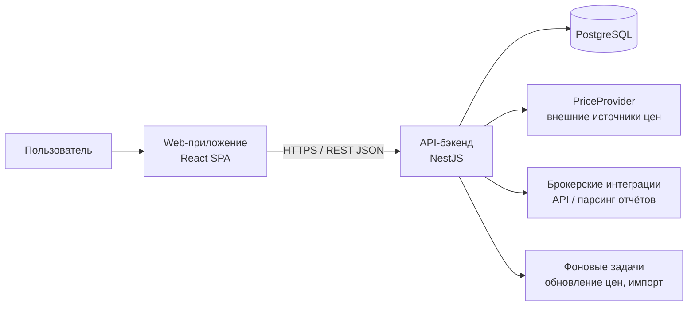
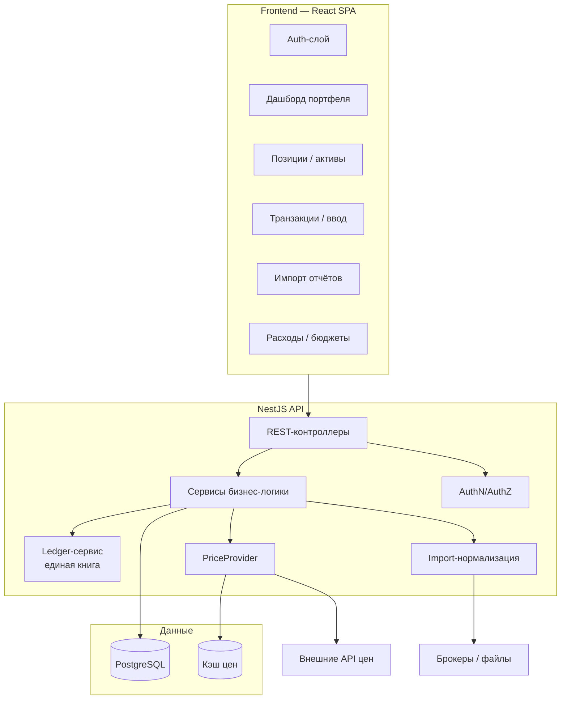

# Системная архитектура

## Цели и ограничения

- Личное финансовое приложение (fintech): учёт портфелей, доходов, расходов.
- **UI**: современный, «узкий» (не на всю страницу), в стиле банковского приложения — центрированная колонка, mobile-first.
- **Разделение**: фронтенд (SPA) + отдельный бэкенд с REST API + БД.
- **Авторизация** пользователей.
- Мультивалютность, внешние источники цен, интеграции с брокерами.

## Контекст (C4, уровень 1)

## Компоненты (уровень 2)

## Технологический стек (итог)

| Слой | Технология | Обоснование |
|---|---|---|
| Язык | TypeScript | Единый тип на фронте и бэке, общие DTO/контракты |
| Монорепо | pnpm + turborepo (или npm workspaces) | Общие пакеты, единый CI |
| Frontend | React 18 + Vite + Tailwind CSS | Быстрая разработка, узкий mobile-first UI |
| Состояние/данные | TanStack Query + Zustand | Серверный кэш и локальное состояние |
| Backend | NestJS | Структура, DI, модульность для fintech-домена |
| ORM | Prisma | Типобезопасный доступ к БД, миграции |
| БД | PostgreSQL | ACID, транзакции, JSONB, надёжность |
| Auth | JWT (access/refresh) + bcrypt | См. ADR-004 |
| Валидация | class-validator / zod | Контракты API |
| Тесты | Vitest (unit), Supertest (e2e) | — |
| Фоновые задачи | NestJS Schedule / BullMQ | Обновление цен, импорт |

Детали и альтернативы — в [ADR-001](ADR-001-tech-stack.md) и [ADR-002](ADR-002-database.md).

## Ключевые архитектурные принципы

1. **Единая транзакционная книга** — все позиции и стоимость выводится из транзакций; snapshot-ввод конвертируется в opening-транзакцию (ADR-003).
2. **Доходы как события** — дивиденды/купоны моделируются как income events (ADR-006).
3. **Цены через абстракцию** — внешние источники только через `PriceProvider` с адаптерами и кэшем (ADR-005).
4. **Нормализация импорта** — все источники (API брокеров, CSV/XML) приводятся к единому каноническому формату транзакций; импорт идемпотентен (dedup по source id).
5. **Деньги — целые числа** в минимальных единицах + код валюты (ADR-002).

## Поток данных (пример: оценка портфеля)

1. Пользователь запрашивает дашборд.
2. Backend читает позиции из ledger (агрегация транзакций).
3. Для каждой позиции запрашивается текущая цена через `PriceProvider` (кэш → внешний источник).
4. Стоимость = количество × цена; при мультивалютности — пересчёт через FX-курс.
5. Ответ возвращается фронту; фронт кэширует через TanStack Query.

## Безопасность

- Пароли — bcrypt; JWT access (короткий) + refresh (длинный, ротация).
- Все данные пользователя изолированы по `userId` (row-level ownership в сервисах).
- Секреты и ключи API — только в env/secret manager, никогда в коде.
- Не логировать чувствительные поля.