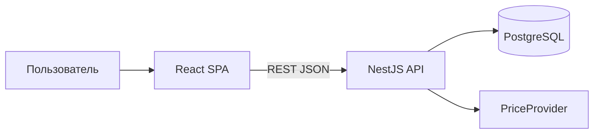

# Системная архитектура

> Браузер говорит с API, API — с базой и ценами. Стек — в [корневом README](../../README.md).

## Суть

Пользователь открывает веб-приложение. Оно ходит в NestJS API. API хранит данные в PostgreSQL и спрашивает цены/курсы у внешних источников через `PriceProvider`.

| Часть | Статус |
|---|---|
| Web, API, БД | готово |
| Цены (MOEX / Yahoo / CoinGecko) + FX | готово |
| Импорт брокеров, фоновые джобы, бюджеты | позже |

## Поток: «сколько стоит портфель»

1. Фронт просит дашборд.
2. API читает позиции (они уже посчитаны из книги сделок).
3. Для каждой бумаги берёт цену через `PriceProvider` (сначала кэш).
4. Стоимость = количество × цена; при нужде — пересчёт в валюту отображения.
5. Фронт кэширует ответ (TanStack Query).

Подробнее — [позиции](../features/positions.md).

## Безопасность

- Пароли — bcrypt; вход — JWT (короткий access + длинный refresh).
- Данные только свои (`userId`).
- Секреты — в env, не в коде и не в логах.

## См. также

- [Правила](rules.md)
- [ADR-001 стек](../decisions/ADR-001-tech-stack.md)
- [Обзор функций](../features/README.md)
