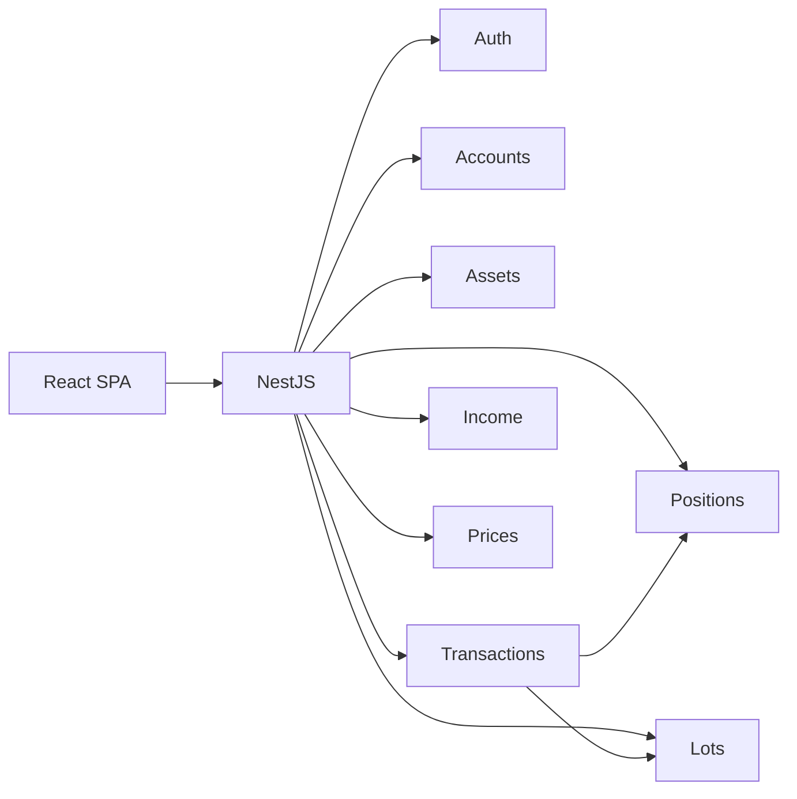

# Функции

> Что уже умеет продукт и как это устроено. Маршруты API — в [контракте](../api/contract.md), не здесь.

Правила учёта — [architecture/rules.md](../architecture/rules.md).

## Модули

| Файл | О чём |
|---|---|
| [auth.md](auth.md) | Регистрация, вход, refresh |
| [accounts-assets.md](accounts-assets.md) | Счета и справочник активов |
| [transactions.md](transactions.md) | Книга сделок и снапшот |
| [income.md](income.md) | Дивиденды, купоны, DRIP |
| [positions.md](positions.md) | Позиции, кэш, портфель, FIFO |
| [history.md](history.md) | Графики стоимости |
| [composition.md](composition.md) | Модалка «Состав» — хаб учёта |
| [prices.md](prices.md) | PriceProvider и FX |
| [web-ui.md](web-ui.md) | Страницы и клиент |
