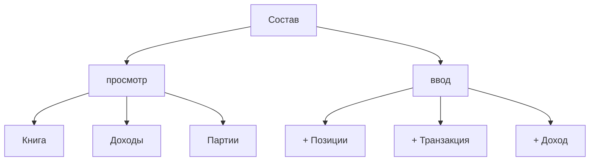

# Состав счёта

> Одна модалка — хаб учёта по счёту: сводка, позиции, просмотр и ввод.

UI: `apps/web/src/dashboard/CompositionModal.tsx`.  
Вход: дашборд → **Состав**.

## Суть

| Строка сводки | Формула |
|---|---|
| **взносы** | deposit + opening − withdrawal |
| **стоимость** | сумма `currentValue` позиций **включая кэш** |
| **изменение** | стоимость − взносы |

«Внесено» на дашборде — это AVCO cost basis (`totalCostBasis`). Здесь **взносы** — внешний капитал из книги.

## Как это работает

**Позиции** (`PositionsTable`, брокерский layout — две строки в ячейке):

| Колонка | Верх | Низ |
|---|---|---|
| Актив | `asset.name` | `asset.symbol` |
| Кол-во | quantity | — |
| Вложено | себестоимость (`quantity × avgCostBasis`) | средняя цена за шт |
| Текущая стоимость | `currentValue` | `currentPrice` |
| Прибыль | unrealized + realized + income net | % к себестоимости |
| За день | `dayChange` | `dayChangePct` |
| Доля | % от суммы `currentValue` счёта (включая кэш) | — |

Hover: прибыль → разбивка цена / доход; стоимость кэша → депозит / доход / комиссия / налоги / сделки.  
Модалка Composition — `max-w-5xl`; таблица с `overflow-x-auto` на узких экранах.  
**Закрытые** (`quantity = 0`) скрыты по умолчанию.

**+ Позиции** — только на пустом счёте (снапшот); в строке можно сразу указать опциональный доход (без DRIP) — после opening фронт пишет `POST /income` с `distributed: true` (в прибыль, не в кэш).  
**+ Транзакция** — покупка / продажа / ввод / вывод (покупка «с пополнением» или «из кэша»).  
**+ Доход** — дивиденд / купон / DRIP (для уже ведущегося счёта или если доход не указали в снапшоте; по умолчанию зачисляет в кэш).

| Тип | Позиция | Кэш | Взносы |
|---|---|---|---|
| deposit / withdrawal | — | ± | ± |
| buy из кэша | + | − | — |
| buy с пополнением | + | ≈ 0 (deposit на amount+fee, затем buy) | +deposit |
| sell | − | + | — |
| opening | + | 0 | + |
| income (без DRIP) | — | + | — |

После записи инвалидируются react-query ключи позиций / книги / партий / портфеля (/ доходов).

## Где в коде

| Часть | Путь |
|---|---|
| Модалка | `CompositionModal.tsx` |
| Таблица | `PositionsTable.tsx` |
| Взносы / разбивка кэша | `apps/web/src/lib/contributions.ts`, `cash-breakdown.ts` |

## См. также

- [Позиции](positions.md), [транзакции](transactions.md), [доходы](income.md), [история](history.md)
